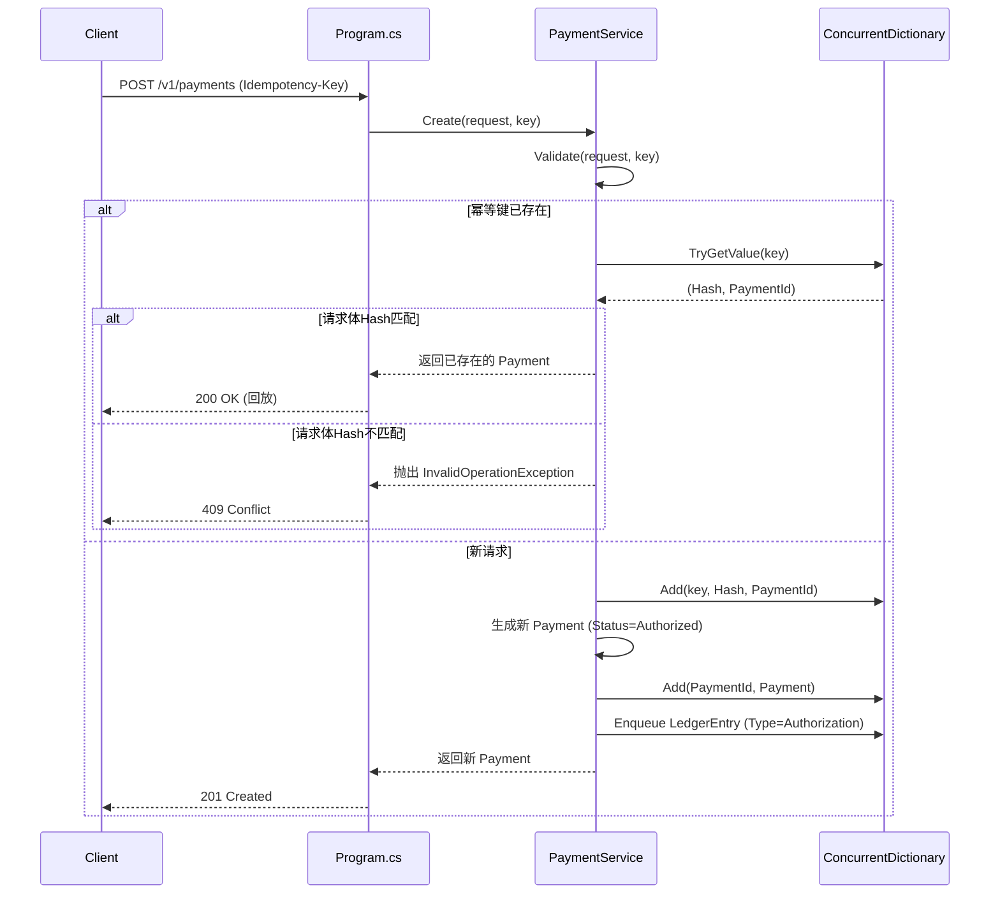
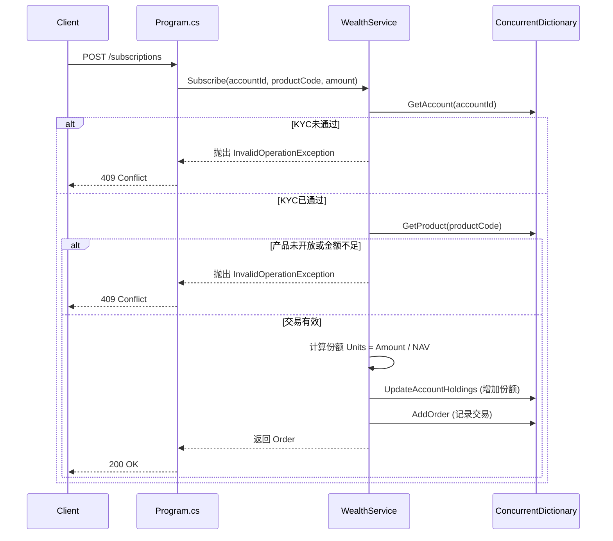

# TestFinance 代码详细设计文档

本文档基于仓库当前的代码实现，详细分析三个服务（支付、信贷、理财）的核心主流程、类结构与关键方法，为代码维护与生产落地提供参考。

---

## 1. 整体架构

本项目包含三个独立的 ASP.NET Core Minimal API 服务，每个服务都遵循类似的结构：

1.  **`Program.cs`**：入口文件，负责依赖注入与 HTTP 管道配置。
2.  **`*Domain.cs`**：核心业务逻辑实现，包含领域模型（Record）与服务类。

### 1.1 通用架构模式

所有服务均采用**简洁的内存仓储模式**，核心逻辑不依赖任何外部基础设施（如数据库、消息队列），便于独立测试和替换。

```text
[ASP.NET Core Pipeline]
           |
           v
  [MapGet/MapPost 处理器]
           |
           v
  [*Service 类] <-- 核心业务逻辑 (Domain Layer)
           |
           v
  [ConcurrentDictionary] <-- 内存状态存储 (Infrastructure Layer)
```

---

## 2. 支付服务 (Payments.Api)

### 2.1 核心类结构

*   **`Payment` (Record)**：支付订单实体，包含 `Id`, `Amount`, `Status`, `RefundedAmount` 等字段。
*   **`PaymentStatus` (Enum)**：支付状态枚举：`Authorized`, `Captured`, `Refunded`, `Failed`。
*   **`LedgerEntry` (Record)**：账本条目，记录支付流水。
*   **`PaymentService` (Class)**：支付服务核心类，管理支付生命周期。

### 2.2 主流程设计 (PaymentService)

`PaymentService` 类是单例服务，内部使用 `ConcurrentDictionary` 维护支付订单和幂等键的内存索引。

#### 2.2.1 创建支付 (`Create`)



**关键点**：
*   **幂等性**：通过 `Idempotency-Key` 与请求体 SHA-256 哈希结合实现。
*   **账本记录**：每次支付动作（创建、捕获、退款）都会生成一条 `LedgerEntry`。

#### 2.2.2 捕获与退款 (`Capture`, `Refund`)

这两个方法内部都调用了通用的 `Transition` 方法，该方法负责状态机流转、参数校验和账本记录。

```csharp
// Transition 方法核心逻辑
private Payment Transition(Guid id, Func<Payment, bool> allowed, Func<Payment, Payment> update, string entryType, Func<Payment, decimal> amount)
{
    lock (_gate) // 保证线程安全
    {
        var old = Get(id);
        if (!allowed(old)) throw new InvalidOperationException("非法状态转换");
        
        var changed = update(old); // 应用状态变更
        _payments[id] = changed;  // 更新内存存储
        _ledger.Enqueue(new LedgerEntry(id, entryType, amount(old), ...)); // 记录账本
        
        return changed;
    }
}
```

---

## 3. 信贷服务 (Lending.Api)

### 3.1 核心类结构

*   **`Loan` / `LoanApplication` (Record)**：贷款实体与申请 DTO。
*   **`LoanStatus` (Enum)**：贷款状态：`Submitted`, `Approved`, `Rejected`, `Disbursed`, `Closed`。
*   **`Installment` (Record)**：分期还款计划条目。
*   **`LendingService` (Class)**：信贷服务核心类。

### 3.2 主流程设计 (LendingService)

#### 3.2.1 评分与申请 (`Submit`)

*   **核心逻辑**：接收申请参数，调用 `Score` 方法计算风险评分，保存为 `Submitted` 状态的贷款记录。
*   **评分公式** (硬编码在 `LendingDomain.cs`)：
    ```csharp
    Score = Clamp((CreditScore - 300)/6 - (int)(MonthlyDebt/MonthlyIncome*100), 0, 100)
    ```

#### 3.2.2 审批决策 (`Decide`)

*   **核心逻辑**：基于评分和负债率规则进行自动审批。
*   **规则实现**：
    ```csharp
    // 硬编码决策规则
    bool approved = (riskScore >= 60) && 
                    (monthlyIncome * 0.4 - monthlyDebt >= requestedAmount / termMonths * 1.08);
    ```

#### 3.2.3 放款与还款 (`Disburse`, `Repay`)

*   **放款**：生成等额本息还款计划 (`BuildSchedule`)，状态变更为 `Disbursed`。
*   **还款**：标记指定分期为 `Paid`，若所有分期均已还款，状态变更为 `Closed`。

---

## 4. 投资理财服务 (Wealth.Api)

### 4.1 核心类结构

*   **`Product` (Record)**：金融产品实体。
*   **`InvestmentAccount` (Record)**：投资账户实体，包含持仓字典 `Units`。
*   **`Order` (Record)**：交易订单实体。
*   **`WealthService` (Class)**：理财服务核心类。

### 4.2 主流程设计 (WealthService)

#### 4.2.1 产品与账户

*   **产品初始化**：在 `WealthService` 构造函数中硬编码初始化了两个演示产品（`CASH-CNY` 活期、`BOND-001` 债券）。
*   **KYC 流程**：账户创建后为 `Pending` 状态，需通过 `VerifyKyc` 审核后才能交易。

#### 4.2.2 交易执行 (`Subscribe`, `Redeem`)



**关键点**：
*   **份额计算**：`Units = round(amount / nav, 6)`，保留 6 位小数。
*   **持仓更新**：通过操作字典 `Units` 实现份额的增减。

#### 4.2.3 账户估值 (`Valuation`)

*   **核心逻辑**：遍历账户所有持仓，按 `Units * NAV` 计算每只产品的市值，求和得到总资产。
*   **注意**：当前实现依赖产品的**当前** NAV，非交易时的历史 NAV。

---

## 5. 设计模式总结

| 模式 | 应用位置 | 说明 |
| :--- | :--- | :--- |
| **单例模式** | 所有 `*Service` 类 | 通过 `AddSingleton` 注册，全局唯一实例。 |
| **仓储模式 (内存版)** | `ConcurrentDictionary` | 作为数据库的占位实现，提供类似仓储的 `Get/Add/Update` 接口。 |
| **状态机模式** | `PaymentStatus`, `LoanStatus`, `KycStatus` | 明确的状态枚举与合法的状态转移逻辑。 |
| **值对象模式** | `Payment`, `Loan`, `Product` 等 Record | 使用不可变的 Record 类型定义核心业务实体。 |
| **门面模式** | `PaymentService`, `LendingService`, `WealthService` | 为控制器提供简化的调用接口，屏蔽内部实现细节。 |

## 6. 生产落地改造点

要将此 Demo 代码转化为生产级应用，需要进行以下改造：

1.  **持久化**：将 `ConcurrentDictionary` 替换为 EF Core + PostgreSQL。
2.  **异步化**：所有方法改为 `async Task<...>`，使用 `await` 调用数据库/外部服务。
3.  **引入 Outbox**：在同一事务中写入 `outbox_messages` 表。
4.  **引入真正的幂等表**：替代内存中的 `_idempotency`。
5.  **引入日志与监控**：添加 Serilog、OpenTelemetry。
6.  **配置化**：将硬编码的评分规则、产品列表移至配置文件或数据库。
