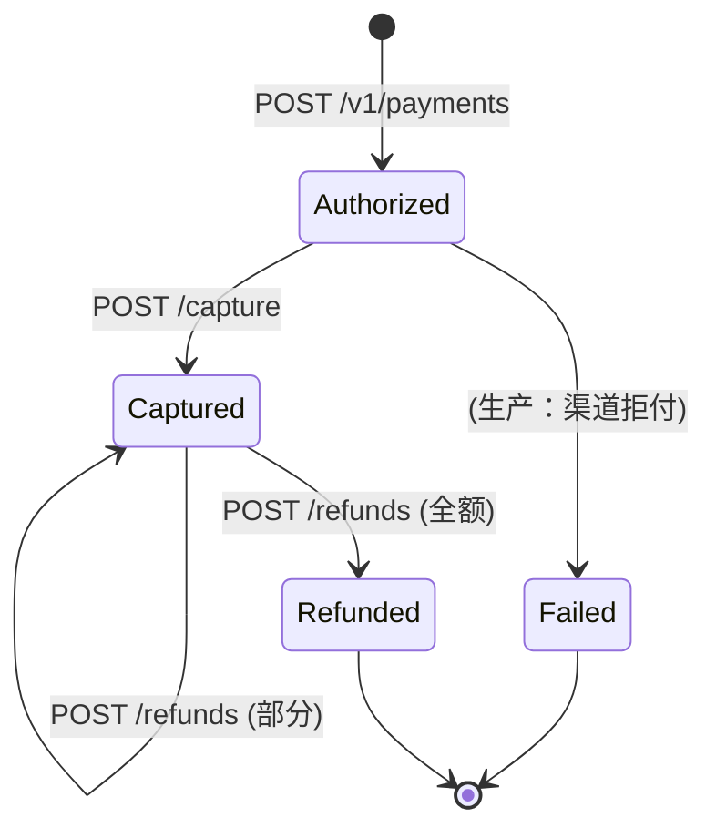
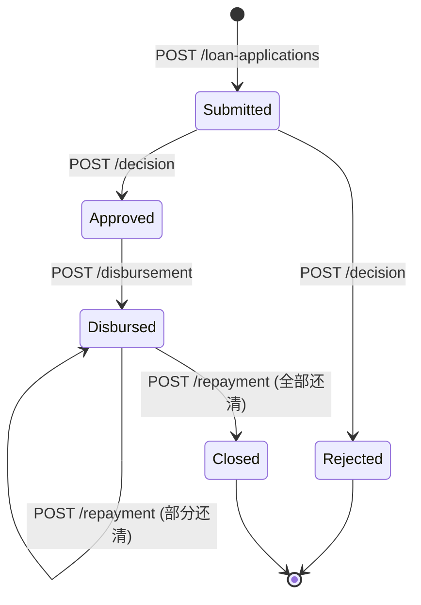
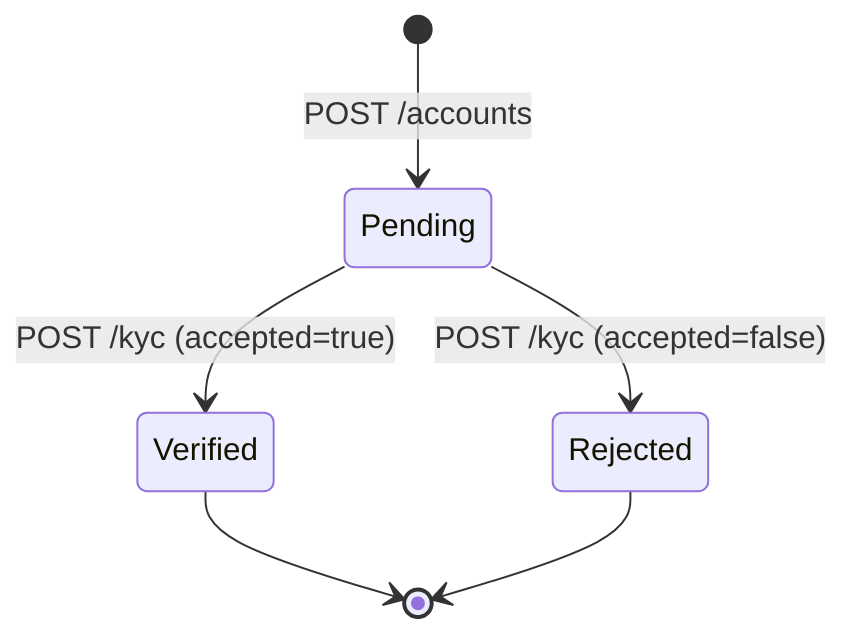

# 网络接口出入参文档

> 基于 .NET 8 / ASP.NET Core Minimal API 搭建。本文档约定了三个服务的**网络协议、通用头、错误语义**，并逐个列出请求/响应字段。生产环境需在 API Gateway 前置 OIDC/JWT 验签、mTLS、WAF、限流与 PII 脱敏，业务服务只信任已验证的身份声明（见 [architecture.md](./architecture.md)）。

## 1. 技术栈与通信协议

### 1.1 框架与库

三个 `.csproj` 均只依赖**基础框架 SDK**（`Microsoft.NET.Sdk.Web`），无第三方 NuGet 包，生产上由部署层补全基础设施。

| 类别 | 当前使用 | 生产推荐补充（参考方向） |
| --- | --- | --- |
| Web 框架 | ASP.NET Core 8 Minimal API | 同（或 MVC Controllers，便于 Swagger） |
| 序列化 | 内置 System.Text.Json（默认 camelCase） | 同；或 Newtonsoft.Json 以获得更宽松的金融格式 |
| 路由 | Minimal API `MapGet/MapPost` | 同 |
| 鉴权 | 无（Demo） | API Gateway：OIDC/JWT、mTLS、RBAC、主体访问控制 |
| 日志 | 内置 `ILogger<T>` | Serilog + Seq/Kibana，结构化日志，敏感字段脱敏 |
| 数据库 | 内存 `ConcurrentDictionary` | EF Core 8 / Dapper + Npgsql/MySqlConnector，事务 + Outbox |
| 缓存 | 无 | Redis（OutputCache / 分布式幂等/会话） |
| 消息 | 无 | Kafka / RabbitMQ / Azure Service Bus，后台 Outbox 投递器 |
| 指标 | 无 | OpenTelemetry + Prometheus + Grafana |
| 调用下游 | 无（Demo 内嵌评分） | `HttpClient` + Polly（超时/重试/熔断/隔离）、Correlation ID |
| 配置 | `appsettings.json` + env vars | Key Vault / Consul / Vault，敏感配置动态注入 |
| JSON Schema/文档 | 无 | OpenAPI (Swashbuckle.AspNetCore) 自动生成，版本化 `/swagger/v1/swagger.json` |
| 契约测试 | 无 | Pact / WireMock 驱动的消费者驱动契约测试（CDC） |
| 安全库 | SHA256 用于幂等哈希 | BouncyCastle / System.Security.Cryptography，TLS 1.3 客户端证书 |
| 数据校验 | 手工 `Validate` 方法 | FluentValidation / DataAnnotations |

### 1.2 网络协议总览

| 层 | 协议 | 备注 |
| --- | --- | --- |
| 传输层 | TCP | 默认端口：Payments=5101、Lending=5102、Wealth=5103 |
| 应用层 | HTTP/1.1（开发）；HTTPS/TLS 1.2+（生产） | 生产需启用 mTLS 或上游终止 TLS |
| 负载 | JSON（`Content-Type: application/json; charset=utf-8`） | 字段默认 camelCase；金额 `decimal` 字符串不带尾随零 |
| 幂等 | `Idempotency-Key` 请求头（`POST/PATCH` 写操作必填） | 同键不同载荷 → `409 Conflict`；同键同载荷 → 回放原响应 |
| 认证 | 由 Gateway 前置完成，转发 `X-Subject` / `X-Tenant-Id` / `X-Correlation-Id` | 业务服务不自行验 JWT |
| 限流 | Gateway 令牌桶/漏桶；业务层只做软保护 | 指标：拒绝率 |
| 跨服务 | Outbox → Kafka/RabbitMQ；消费端以 `(event_id)` 唯一约束去重 | 见 [architecture.md](./architecture.md#架构与上线清单) |
| 健康检查 | `GET /health` → `{ "status": "ok" }` | 供负载均衡器/探活使用 |

### 1.3 通用错误响应

所有服务统一返回：

```json
{ "error": "<英文短句>", "details": "<可选字段细节>" }
```

| HTTP 状态码 | 语义 | 常见场景 |
| --- | --- | --- |
| `200 OK` | 成功（查询/状态变更） | |
| `201 Created` | 资源创建成功 | `POST` 新建聚合根 |
| `204 No Content` | 成功无返回体 | （当前代码未使用，建议对删除类操作使用） |
| `400 Bad Request` | 参数校验失败 | `ArgumentException` |
| `401 Unauthorized` | 未认证 | 由 Gateway 返回 |
| `403 Forbidden` | 权限不足 | 由 Gateway 返回 |
| `404 Not Found` | 资源不存在 | `KeyNotFoundException` |
| `409 Conflict` | 状态机不允许/幂等冲突 | `InvalidOperationException`、同 Key 不同载荷 |
| `422 Unprocessable Entity` | 字段格式正确但业务无法受理 | 生产环境建议引入 |
| `429 Too Many Requests` | 被限流 | 由 Gateway 返回 |
| `500 Internal Server Error` | 未捕获异常 | 生产落日志并透传 correlation id |

---

## 2. Payments.Api（端口 5101）

| 方法 | 路径 | 用途 |
| --- | --- | --- |
| POST | `/v1/payments` | 创建授权支付（**必须**带 `Idempotency-Key`） |
| GET  | `/v1/payments/{id}` | 查询支付单 |
| POST | `/v1/payments/{id}/capture` | 捕获 |
| POST | `/v1/payments/{id}/refunds` | 部分/全额退款 |
| GET  | `/v1/payments/{id}/ledger` | 账本明细 |

### 2.1 `POST /v1/payments` — 创建支付

**请求头**
| 头 | 必填 | 说明 |
| --- | --- | --- |
| `Content-Type` | 是 | `application/json` |
| `Idempotency-Key` | **是** | 客户端生成，`<=128` 字符，示例 `order-1001` |
| `Authorization` | Gateway | 由 Gateway 校验 |

**请求体**
```json
{
  "merchantId": "m-1",
  "amount": 88.50,
  "currency": "CNY",
  "reference": "order-1001"
}
```
| 字段 | 类型 | 约束 | 说明 |
| --- | --- | --- | --- |
| `merchantId` | string | 非空 | 商户标识 |
| `amount` | decimal(19,4) | `> 0` | 金额；生产需与 `currency` 精度匹配 |
| `currency` | string | 3 位，ISO 4217 | 示例 `CNY`/`USD`/`EUR` |
| `reference` | string | 非空 | 商户业务单号（对账用） |

**成功响应** `201 Created`，`Location: /v1/payments/{id}`
```json
{
  "id": "018f...uuid",
  "merchantId": "m-1",
  "amount": 88.50,
  "currency": "CNY",
  "reference": "order-1001",
  "status": "Authorized",
  "refundedAmount": 0.00,
  "createdAt": "2026-07-30T12:34:56Z"
}
```

### 2.2 `GET /v1/payments/{id}` — 查询

**路径参数**
| 字段 | 类型 | 说明 |
| --- | --- | --- |
| `id` | `uuid` | 支付单 ID |

**成功响应** `200 OK`：同 §2.1 响应体（字段 `status`/`refundedAmount` 反映最新状态）

### 2.3 `POST /v1/payments/{id}/capture` — 捕获

**成功响应** `200 OK`，响应体：
```json
{
  "id": "018f...",
  "status": "Captured",
  "refundedAmount": 0.00,
  "...": "其余字段同 §2.1"
}
```
**失败**：`409 Conflict`（非 `Authorized` 状态），`404 Not Found`

### 2.4 `POST /v1/payments/{id}/refunds` — 退款

**请求体**
```json
{ "amount": 20.00 }
```
| 字段 | 类型 | 约束 |
| --- | --- | --- |
| `amount` | decimal(19,4) | `> 0` 且 `refundedAmount + amount <= amount` |

**成功响应** `200 OK`
```json
{
  "id": "018f...",
  "status": "Captured",
  "refundedAmount": 20.00,
  "...": "其余字段同 §2.1"
}
```
全额退款时 `status` 变为 `Refunded`。

### 2.5 `GET /v1/payments/{id}/ledger` — 账本明细

**成功响应** `200 OK`
```json
[
  { "paymentId": "018f...", "type": "authorization", "amount": 88.50, "occurredAt": "..." },
  { "paymentId": "018f...", "type": "capture",        "amount": 88.50, "occurredAt": "..." },
  { "paymentId": "018f...", "type": "refund",         "amount": 20.00, "occurredAt": "..." }
]
```

### 2.6 支付状态机



---

## 3. Lending.Api（端口 5102）

| 方法 | 路径 | 用途 |
| --- | --- | --- |
| POST | `/v1/loan-applications` | 提交申请 |
| GET  | `/v1/loans/{id}` | 查询贷款 |
| POST | `/v1/loans/{id}/decision` | 自动评分 + 决策 |
| POST | `/v1/loans/{id}/disbursement` | 放款 |
| POST | `/v1/loans/{id}/installments/{sequence}/repayment` | 偿还指定分期 |

### 3.1 `POST /v1/loan-applications` — 提交申请

**请求体**
```json
{
  "customerId": "c-1",
  "monthlyIncome": 20000.00,
  "monthlyDebt": 5000.00,
  "requestedAmount": 120000.00,
  "termMonths": 24,
  "creditScore": 720
}
```
| 字段 | 类型 | 约束 | 说明 |
| --- | --- | --- | --- |
| `customerId` | string | 非空 | 客户 ID（[PII]，建议脱敏） |
| `monthlyIncome` | decimal(19,4) | `> 0` | 月收入 |
| `monthlyDebt` | decimal(19,4) | `>= 0` | 月债务支出 |
| `requestedAmount` | decimal(19,4) | `> 0` | 申请金额 |
| `termMonths` | int | `1..120` | 期限（月） |
| `creditScore` | int | `300..950` | 信用分 |

**成功响应** `201 Created`
```json
{
  "id": "018f...",
  "application": { "customerId": "c-1", "monthlyIncome": 20000, "...": "..." },
  "status": "Submitted",
  "riskScore": 68,
  "approvedAmount": 0.00,
  "createdAt": "...",
  "schedule": []
}
```
**评分公式**（与 [LendingDomain.cs](../src/Lending.Api/LendingDomain.cs#L66) 一致，整数截断）：
```
riskScore = Clamp((creditScore - 300)/6 - int(monthlyDebt/monthlyIncome*100), 0, 100)
```

### 3.2 `GET /v1/loans/{id}` — 查询

响应同 §3.1 响应体，`status`/`approvedAmount`/`schedule` 反映最新状态。

### 3.3 `POST /v1/loans/{id}/decision` — 自动决策

**成功响应** `200 OK`，决策规则：
- `riskScore >= 60` **且** `monthlyIncome * 0.4 - monthlyDebt >= requestedAmount / termMonths * 1.08` → `Approved`
- 否则 → `Rejected`

### 3.4 `POST /v1/loans/{id}/disbursement` — 放款

仅 `Approved` 状态可调用。成功响应 `200 OK`，返回含完整还款计划：
```json
{
  "...": "同 §3.1 字段",
  "status": "Disbursed",
  "approvedAmount": 120000.00,
  "schedule": [
    { "sequence": 1, "dueDate": "2026-08-30", "principal": 5000.00, "interest": 800.00, "paid": false },
    "...": "..."
  ]
}
```

### 3.5 `POST /v1/loans/{id}/installments/{sequence}/repayment` — 还款

**路径参数**
| 字段 | 类型 | 约束 |
| --- | --- | --- |
| `sequence` | int | `>= 1` 且 `<= 分期总数` |

**成功响应** `200 OK`，对应分期 `paid=true`；全部还清时 `status` 变为 `Closed`。

### 3.6 贷款状态机



---

## 4. Wealth.Api（端口 5103）

| 方法 | 路径 | 用途 |
| --- | --- | --- |
| GET  | `/v1/products` | 查询产品列表 |
| POST | `/v1/accounts` | 开户 |
| POST | `/v1/accounts/{id}/kyc` | KYC 审核 |
| POST | `/v1/accounts/{id}/subscriptions` | 申购 |
| POST | `/v1/accounts/{id}/redemptions` | 赎回 |
| GET  | `/v1/accounts/{id}/valuation` | 账户估值 |

### 4.1 `GET /v1/products` — 产品列表

**成功响应** `200 OK`
```json
[
  { "code": "CASH-CNY", "name": "现金管理", "currency": "CNY", "nav": 1.000000, "minimumSubscription": 1.00,  "isOpen": true },
  { "code": "BOND-001", "name": "稳健债券", "currency": "CNY", "nav": 1.043200, "minimumSubscription": 100.00, "isOpen": true }
]
```
| 字段 | 类型 | 说明 |
| --- | --- | --- |
| `code` | string | 产品代码，例 `CASH-CNY` / `BOND-001` |
| `name` | string | 产品名称 |
| `currency` | string | 3 位 ISO 货币代码 |
| `nav` | decimal(19,6) | 当前净值（6 位小数） |
| `minimumSubscription` | decimal(19,4) | 起投额 |
| `isOpen` | bool | 是否开放申购赎回 |

### 4.2 `POST /v1/accounts` — 开户

**请求体**
```json
{ "customerId": "c-1" }
```

**成功响应** `201 Created`
```json
{
  "id": "018f...",
  "customerId": "c-1",
  "kyc": "Pending",
  "units": {}
}
```
| 字段 | 类型 | 说明 |
| --- | --- | --- |
| `id` | uuid | 账户 ID |
| `customerId` | string | 客户 ID（[PII]） |
| `kyc` | `Pending` / `Verified` / `Rejected` | KYC 状态 |
| `units` | map<string, decimal(19,6)> | 持仓，键为产品代码，值为份额 |

### 4.3 `POST /v1/accounts/{id}/kyc` — KYC 审核

**请求体**
```json
{ "accepted": true }
```
| 字段 | 类型 | 说明 |
| --- | --- | --- |
| `accepted` | bool | `true` → `Verified`，`false` → `Rejected` |

**限制**：状态只能从 `Pending` 迁移一次，重复调用返回 `409 Conflict`。

### 4.4 `POST /v1/accounts/{id}/subscriptions` — 申购

**请求体**
```json
{ "productCode": "BOND-001", "amount": 5000.00 }
```
| 字段 | 类型 | 约束 |
| --- | --- | --- |
| `productCode` | string | 产品代码，产品须 `isOpen=true` |
| `amount` | decimal(19,4) | `>= minimumSubscription` |

**前置条件**：账户 `kyc = Verified`。

**成功响应** `200 OK`
```json
{
  "id": "018f...",
  "accountId": "018a...",
  "productCode": "BOND-001",
  "type": "subscribe",
  "units": 4792.753068,
  "nav": 1.043200,
  "createdAt": "..."
}
```
份额计算：`units = round(amount / nav, 6, MidpointRounding.ToEven)`

### 4.5 `POST /v1/accounts/{id}/redemptions` — 赎回

**请求体**
```json
{ "productCode": "BOND-001", "units": 1000.000000 }
```
| 字段 | 类型 | 约束 |
| --- | --- | --- |
| `productCode` | string | 产品代码，产品须 `isOpen=true` |
| `units` | decimal(19,6) | `> 0` 且 `<= 持仓` |

**成功响应** `200 OK`，结构同 §4.4，`type = "redeem"`。

### 4.6 `GET /v1/accounts/{id}/valuation` — 账户估值

**成功响应** `200 OK`
```json
{ "accountId": "018a...", "value": 4792.753068, "currency": "CNY" }
```
估值 = Σ(每只产品持仓份额 × 产品当前 NAV)。

### 4.7 账户状态机（KYC）



---

## 5. 跨服务事件（通过 Outbox → 事件总线）

| 发布方 | 事件类型 | 订阅方 | 用途 |
| --- | --- | --- | --- |
| Payments | `PaymentCaptured` | Lending / Wealth | 放款入金确认、理财入金 |
| Payments | `PaymentRefunded` | Lending / Wealth | 退款冲正 |
| Payments | `PaymentFailed` | 原调用方 | 失败通知 |
| Lending | `LoanApproved` | 通知服务 | 待客户接受 |
| Lending | `LoanDisbursed` | Payments → 触发放款支付 |
| Lending | `InstallmentPaid` | 通知/征信 | 还款记录 |
| Wealth | `KycVerified` / `KycRejected` | 风控/合规 | KYC 结果回写 |
| Wealth | `OrderExecuted` | 对账/托管 | 交易流水 |

每条事件字段必须包含 `event_id (uuid)`、`aggregate_id`、`occurred_at`、`correlation_id`；消费者以 `(event_id)` 唯一约束做幂等去重。

## 6. 安全与合规提示

- **TLS**：生产必须 TLS 1.2+；建议 TLS 1.3；客户端证书（mTLS）用于服务间调用。
- **HSTS/CSP**：Gateway 强制；业务服务默认 `forwarded` 信任 Gateway。
- **PII**：`customerId`、`merchantId` 等字段在日志/审计中脱敏；保留期遵守监管要求。
- **金额**：`decimal`、币种代码、ISO 4217 精度校验；禁止浮点。
- **幂等**：写操作必须 `Idempotency-Key`；重试必须带原 Key。
- **版本化**：建议在 `Accept` 头或 URL 路径中引入版本号（当前路径为 `/v1/`，便于后续演进）。
- **时区**：所有时间字段一律 UTC ISO 8601 (`2026-07-30T12:34:56Z`)。
